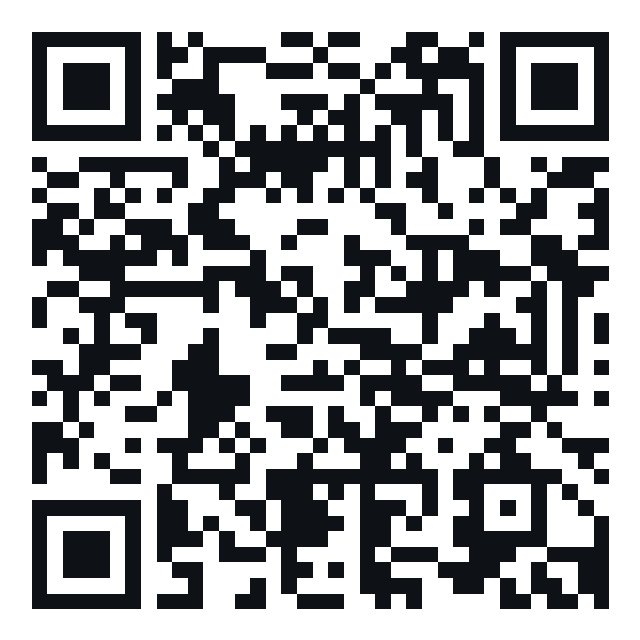
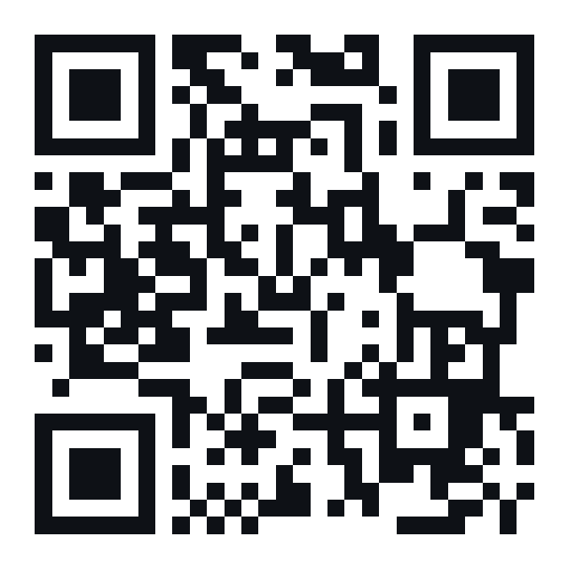

# 핸즈프리 PT

폰을 세워두고 운동만 하면 **전면 카메라가 어떤 운동인지 알아보고, 횟수를 소리로 세고, 자세를 교정하고, 기록을 정리**하는 웹앱(PWA).
안드로이드 APK와 브라우저용 PWA를 제공한다. 아이폰·갤럭시 브라우저에서는 "홈 화면에 추가"로 사용할 수 있다.

- 포즈 인식: Google MediaPipe Pose Landmarker(관절 33점, 폰 안에서 처리 — **영상은 기기 밖으로 나가지 않음**)
- 판단 로직(운동 판별·횟수·세트·자세 교정): `app/js/engine/` — 실제 운동 영상으로 수치를 맞춘 규칙
- 기록: 이 기기의 브라우저 저장소(localStorage). 설정 화면에서 백업 파일로 내보내기·불러오기

## 바로 써보기

| 어디서 | 방법 |
|---|---|
| **안드로이드 폰 (앱)** | 폰에서 [handsfree-pt.apk 받기](https://github.com/haho240414/handsfree-pt/releases/latest/download/handsfree-pt.apk) → 설치(처음이면 "출처를 알 수 없는 앱 설치" 허용) → 첫 실행 때 카메라 허용 |
| **아무 폰 브라우저** | https://haho240414.github.io/handsfree-pt/ 접속 → 공유/메뉴 → **홈 화면에 추가** |
| **이 맥 (웹캠)** | `핸즈프리PT.command` 더블클릭 → 브라우저가 열림 → **운동 시작** → 노트북에서 2~3m 떨어져 운동 |
| **녹화한 영상** | 설정 → *녹화한 영상으로 분석* → 영상 파일 선택 (재생보다 빠르게 분석해 기록으로 저장) |

| 안드로이드 APK | 웹 버전 |
|:-:|:-:|
|  |  |

폰을 바닥·선반에 세우고 전신이 나오게 2~3m 뒤로. 소리를 켜면 "스쿼트, 하나, 둘…" 음성이 나온다(설정 → 소리 확인).

### 안드로이드에 설치하기 (처음 한 번)

1. 폰에서 위 링크를 열거나 QR을 찍는다 → "이 파일은 기기에 해로울 수 있습니다" 경고가 나오면 **다운로드**
2. 다운로드 알림(또는 내 파일 → 다운로드)에서 `handsfree-pt.apk` 를 연다
3. "출처를 알 수 없는 앱" 안내가 나오면 **설정 → 이 출처 허용** 을 켜고 돌아와 **설치**
   (삼성: 설정 → 애플리케이션 → 특별한 접근 → 출처를 알 수 없는 앱 설치 → 크롬/내 파일 허용)
4. Play 프로텍트가 "알 수 없는 앱"이라고 하면 **세부정보 → 무시하고 설치** (스토어에 안 올린 개인 앱이라 나오는 경고)
5. 첫 실행 때 **카메라 허용** → 설정 → **소리 확인** 으로 한국어 음성이 나오는지 확인
6. 새 버전은 같은 링크로 받아 설치하면 기록을 유지한 채 업데이트된다 (같은 서명 키로 만들기 때문)

- 뼈대가 안 그려지거나 운동 시작 때 앱이 멈추면 **설정 → GPU 가속 끄기**(호환 모드). 앱이 AI 가속 중 멈추면 다음 실행 때 자동으로 호환 모드로 바뀐다
- 안드로이드 8.0 이상 (헬스 커넥트 연동 라이브러리 최소 버전)
- 앱을 지우면 기록도 지워진다 → 설정 → 백업 파일 저장(공유 창)으로 가끔 백업
- 참고: 구글은 2026년부터 일부 국가에서, 이후 전 세계적으로 '설치 파일(APK)도 개발자 등록'을 요구하는 정책을 단계적으로 도입 중이다. 한국에 적용되면 개발자 계정 등록이 필요할 수 있다

### 안드로이드 앱은 어떻게 만들어지나

- `app/` 웹앱을 [Capacitor](https://capacitorjs.com) 로 감싼 네이티브 앱(`android/`). AI 모델·엔진이 APK 안에 들어 있어 **오프라인에서도 동작**
- WebView 가 못 하는 것만 네이티브로: 음성은 폰 기본 TTS(`@capacitor-community/text-to-speech`), 화면 꺼짐 방지(`MainActivity`), 뒤로가기(운동 중엔 안 꺼짐), 백업 파일은 공유 창,
  헬스 커넥트 쓰기는 앱 안의 플러그인(`HealthConnectPlugin.kt` — 공개 플러그인들은 운동 세션 쓰기를 지원하지 않아 직접 만듦)
- 빌드는 GitHub Actions(`.github/workflows/android.yml`): APK 빌드 → **안드로이드 에뮬레이터(API 34)에 설치해 단계별 자동 점검** → 통과하면 Releases 의 다운로드 링크 갱신. `main` 에 올리면 자동
  - 점검 항목(2026-09-30 v1.0.2 통과): 네이티브 연결(TTS·뒤로가기·공유·파일), 한국어 TTS, 판단 엔진 계산, AI 모델 로드 1.6초·추론 22~64ms, 가상 카메라로 운동 화면 초당 8장 분석, 운동 중 뒤로가기 무시
  - 에뮬레이터의 가상 GPU(SwiftShader)로 AI 가속을 켜면 에뮬레이터가 통째로 멈춰서, 점검은 호환 모드(CPU)로 한다. 실제 폰은 GPU 가 기본
- 서명 키는 이 맥의 `android-signing/`(git 제외)과 GitHub 비밀값에만 있다. **잃어버리면 다음 버전을 기존 앱 위에 업데이트 못 함** → 따로 백업

## 기능

- **간결한 시작 화면**: 자유 운동·운동 선택·루틴을 고르고 시작. 루틴은 운동과 예상 시간을 먼저 보여 주고 설정·나머지 운동은 펼쳐서 확인.
- **카메라 준비 → 3초 후 시작**: 화면에 몸과 필요한 관절이 보이는지 확인한 뒤 시작. 준비 화면에서 전후면 전환·촬영 도움말 제공. 영상은 원본 비율을 유지해 표시.
- **일시정지·이어가기**: 횟수와 운동 시간이 함께 멈추며, 화면에서 몸을 놓치거나 앱을 벗어나면 자동으로 일시정지. 재개 시 중간 동작을 새 반복으로 세지 않음.
- **실제 횟수로 세트 종료**: 목표 전에 끝내도 실제 인식한 수를 저장. 휴식 중 +30초·직전 기록 수정·다음 세트 시작. 다음 목표·무게는 '운동 상세'에서 조정.
- **운동 검색·최근·즐겨찾기**: 운동 선택에서 이름 검색과 목록 필터. 선택한 운동의 즐겨찾기는 이 기기에 저장되며 백업에도 포함.
- **운동 메모·체감 강도**: 운동 완료에서 세트 수정, 짧은 메모와 체감 강도 기록. 직접 수정 표시와 원래 자세 분석을 분리해 수동 횟수 보정으로 자세 지적이 늘어나지 않음. 기록 화면은 최근 기록부터 표시하고 통계·달력은 펼쳐 보기.
- **오프라인 디자인 자산**: Pretendard(폰트)·Phosphor(아이콘)을 APK/서비스 워커에 포함. 폰트와 아이콘 라이선스는 각 자산 폴더에 보관.

- **자동 인식 모드**: 운동을 고르지 않고 시작 → 1회째에 "스쿼트 같아요"로 알아챈 걸 보여주고, 2회 이어지면 "스쿼트. 둘"처럼 확정해 1회째부터 셈
- **폰 기울기 보정**: 폰을 바닥에 두고 벽에 기대 세우면 카메라가 위를 올려다봐서 몸이 기운 것처럼 보인다 → 폰 기울기 센서로 재서 되돌린다 (시뮬레이션: 25° 기울면 인식 18 → 10~15개, 보정하면 18개 그대로 — `node test/robust.mjs`)
- **화면 구도 안내**: 너무 가깝거나 무릎·머리가 화면 밖이면 "무릎까지 보이게 뒤로 가거나 폰을 낮춰 주세요"처럼 화면·음성으로 (첫 세트 전에만 말함)
- **템포·속도 그래프 (테크노짐·VBT 장비처럼)**: 반복마다 힘주는 구간(당기기·밀기·일어서기)과 돌아오는 구간(풀기·내리기·앉기)을 몇 초에 했는지, 힘주는 속도(m/s)를 잰다. 운동 중엔 속도 곡선(위 = 힘주기, 아래 = 돌아오기)과 반복별 속도 막대, 처음보다 20% 넘게 느려진 반복은 주황(한계가 가깝다는 신호). 요약 화면에 세트별 평균 템포·막판 속도 저하
- **오늘의 루틴(PT 모드)**: 부위(추천·전신·하체·상체·코어·유산소)·장소(맨몸·덤벨·헬스장)·시간(15~60분)·강도(입문·보통·강하게)를 고르면 루틴을 짜 준다.
  '추천'은 최근 기록을 보고 쉰 부위로(어제 하체 → 오늘 상체), 같은 날 같은 조건이면 같은 루틴·'다른 운동으로'를 누르면 바뀐다. 운동·세트·목표 횟수(버티기는 초)·휴식·무게를 고치고 순서를 바꾸고 '내 루틴'으로 저장.
  진행 중엔 화면 위에 전체 진행(운동 2/5 · 전체 4/14세트), 가운데에 **지금 할 운동·세트와 '한 횟수/목표'(5/12)**, 아래에 다음 운동.
  지금 운동만 보고 1회째부터 세서(자동 인식보다 정확) 목표를 채우면 "열둘. 완료!" → 휴식 → 다음 세트, 운동이 바뀌면 카메라 자리 안내.
  3개·1개 남았을 때 추임새, 목표 전에 오래 멈추면 한 만큼 기록, 인식이 안 될 땐 [세트 완료]·[다음 운동 ▸] 버튼. 요약 화면에 목표 대비 달성(세트·횟수)
  - **동작 시범**: 시범 영상에서 뽑은 관절 좌표로 1회 동작을 막대 인형으로 반복 재생(38종, 영상·사진은 안 담음 — `tools/make-demos.mjs` → `app/data/demos.json` 167KB). 시작 전·휴식 중 다음 운동, 루틴 수정 → 운동별 동작 버튼으로 크게
  - **점진적 과부하**: 지난번 루틴 목표를 모든 세트에서 채웠으면 무게(큰 운동 2.5~5kg, 작은 운동 1~2kg)·맨몸은 +2회·버티기는 +5초, 2세트 이상 80%도 못 했으면 그대로/줄임 — 루틴 목록에 이유 표시
  - **휴식 중 조정**: 쉬는 동안 큰 ± 버튼으로 다음 세트 무게·목표를 바로 바꿈(자유 운동은 다음 세트 무게)
  - **준비운동·마무리 스트레칭**(각 3분, 15분 루틴은 2분): 30초마다 동작을 바꿔 가며 음성 안내(제자리 걷기→팔 돌리기→…), 루틴 짜기에서 넣기/빼기
  - **인터벌(시간제 세트)**: '30초 동안 최대한 많이' — 3초 준비 → "시작!" → 10초·3·2·1 신호 → "그만!", 그동안 한 횟수를 기록. 유산소 루틴은 자동으로 인터벌, 운동마다 '목표 방식: 횟수/시간' 선택
- **손 제스처로 휴식 끝내기**: 쉬는 동안 두 손을 머리 위로 쭉 뻗고 2초 → "휴식 끝!" (폰을 만지지 않고). 풀업·랫풀다운·프레스처럼 팔을 머리 위로 드는 운동 앞에선 꺼짐, 설정에서 끄기
- **운동 골라서 시작(헬스장 루틴)**: 오늘 할 운동만 고르면 그 안에서만 인식 → 비슷한 운동끼리 헷갈릴 일이 줄어듦. 하나만 고르면 1회째부터 셈. 무게(kg) 입력 → 세트마다 기록·볼륨 계산
- **세트 자동 분리**: 반복을 멈추면 세트 종료 → "스쿼트 12회. 1세트 완료. 60초 쉬세요" → 휴식 타이머.
  멈춘 뒤 몇 초면 세트로 볼지 **설정 가능**(자동 = 평소 반복 간격의 2.2배·3.5~12초, 또는 3·5·8·10·15초). 멈추면 화면에 "2초 더 쉬면 세트 기록"
- **휴식 시간·다시 시작 알림 설정**: 휴식 0초~10분(±15초, 빠른 선택 30초~3분), 운동 중 휴식 화면에 [+30초]·[휴식 끝내기] 버튼.
  끝나기 30초·10초·5초 전 음성, '셋·둘·하나' 카운트다운을 골라서 켜고, 끝나면 삐 소리 + "휴식 끝"
- **카메라 고르기·넓게 보기**: 설정 → 카메라 찾기로 앱에서 접근 가능한 카메라를 보여주고(이름에 광각이 있거나 줌을 1배 아래로 줄일 수 있으면 표시) 골라 쓴다.
  자동 전면 + 넓게 보기에서는 이름으로 확인된 전면 광각을 우선 열고, 실패하면 기본 전면으로 복구한다. 직접 고른 카메라는 유지한다.
  넓게 보기는 4:3·크롭 없는 화면·최소 줌을 요청하며, 줌 변경 때도 기존 화면 비율·해상도 설정을 유지한다.
  실제 광각 전환·줌·4:3 지원은 기종과 WebView 에 따라 다르며, 갤럭시 기본 카메라의 넓은 셀피 모드가 앱에 노출되지 않을 수도 있다.
  운동 화면에 실제 전면/후면·화면 비율·보고된 줌을 표시한다. 4:3 만으로 광각 렌즈 전환을 보장하지 않는다.
  몸이 너무 작거나 관절이 가려지고 화면 밖으로 잘리면 카운트와 별도의 안내를 운동 중에도 표시한다(0.8초 지속 시 표시, 잠깐의 가림은 무시)
- **자세 교정**: 같은 문제가 최근 3회 중 2회 나오면 짧게 음성으로 ("여섯. 더 깊게"), 같은 말은 3회 안에 반복 안 함. 요약 화면에 운동별 피드백
- **플랭크**: 자세가 2.5초 유지되면 시간 재기 시작, 10초마다 음성, 무너지면 종료
- **기록**: 요약(세트·횟수·무게·자세), 달력, 이번 주 통계·연속 운동일, 운동별 8주 추이 그래프, 세트 수정·추가·삭제
  - **최고 기록·예상 1RM**: 운동별 최고 무게(× 횟수)·예상 1RM(무게 × (1 + 횟수/30), 12회 이하만)·맨몸은 한 세트 최다 횟수·버티기는 최장 시간. 요약 화면에 '🏆 새 기록!'(이전 기록보다 좋아졌을 때만, 처음 해 본 운동은 제외)
  - **이번 주 부위별 세트·볼륨**: 하체 / 가슴·어깨 / 등 / 팔 / 코어 / 유산소별 세트 수와 kg 볼륨 — 한쪽만 하고 있는지 한눈에 (0세트 부위는 '추천' 루틴이 채움)
  - **칼로리 어림값**: 운동별 강도(MET: 큰 근력 운동 5·작은 운동 3.5·코어 3.8·맨몸 유산소 8, 세트 사이 2.5) × 몸무게(설정 → 내 정보) × 시간. 30분 근력 운동(70kg) ≈ 110~130kcal로 하버드 의대 표와 비슷하게 맞췄지만 ±30% 어림값
- **삼성 헬스·헬스 커넥트 연동 (안드로이드 앱)**: 설정 → 건강 앱 연동 → '헬스 커넥트에 저장'을 켜면(권한 창에서 허용) 운동이 끝날 때
  헬스 커넥트에 **운동 세션**(근력 운동 / 유산소만 했으면 인터벌 운동, 세트마다 스쿼트·런지·컬 같은 세트 종류와 횟수, 세트 요약 메모)과
  **총 소모 칼로리**(어림값)를 쓴다. 삼성 헬스는 헬스 커넥트와 운동 세션·운동 칼로리를 주고받으므로, 헬스 커넥트에서 삼성 헬스의 읽기 권한이 켜져 있으면 삼성 헬스에도 보인다.
  읽기 권한은 요청하지 않음(쓰기만). 세트를 고치면 같은 기록이 고쳐지고(기록 id 고정), 앱에서 기록을 지우면 헬스 커넥트에서도 지운다. 영상 분석 기록은 실제 운동 시각이 아니라 보내지 않음.
  안드로이드 14+ 는 헬스 커넥트가 내장, 9~13 은 플레이 스토어의 '헬스 커넥트' 앱 필요(없으면 설치 안내). 개인정보 처리방침: `app/privacy.html`
- **진단 기록**: 인식이 이상했으면 요약 화면에서 '진단 기록 저장·공유' → 그 운동에서 AI 가 본 관절 좌표(영상·사진 아님, 최근 20분, 20분 ≈ 8MB)를 파일로 내보낸다. 개발 쪽에서 `node tools/replay.mjs <파일>` 로 그대로 재현해 고친다. 자동 전송 없음
  - **고친 횟수 = 정답**: 요약 화면에서 세트를 고치면 앱이 센 원래 값이 남고(직접 추가한 세트·지운 세트도), 진단 기록에 '정답'으로 함께 담긴다.
    진단 기록 창의 메모 칸에 "앱 스쿼트 6회 → 실제 스쿼트 7회"처럼 미리 적힌다. replay 는 운동별로 정답 / 재현을 나란히 보여주고,
    `--save 이름` 하면 fixture 저장 + (운동이 한 종류면) 정답표(test/truth.json)에 자동 추가 → 다음 eval 부터 채점에 들어간다
- **자리 잡기**: 첫 세트 전(루틴은 운동이 바뀔 때마다) 화면 테두리가 주황/초록, 1.5초 잘 보이면 "좋아요. 이 자리에서 시작하세요"
- **배터리 절약**: AI 분석은 초당 15장(설정 '분석 속도', 기준 영상도 15장이라 정확도 동일), 미리보기는 카메라 프레임마다. 빠른 운동(반복 간격 1초 미만)은 매회 삐 소리 + 5회마다 숫자
- 가로로 세운 폰: 카메라는 왼쪽, 횟수·진행률·버튼은 오른쪽. 세로 화면은 카메라 아래 숫자·버튼을 배치하고 상세 정보는 펼쳐 보기
- 화면 꺼짐 방지(Wake Lock), 오프라인 동작(서비스 워커), 라이트/다크 테마

## 지원 운동 (40종)

`O` = 실제 영상으로 횟수를 확인한 운동, `베타` = 규칙만 있고 영상 검증이 부족한 운동(앱에서도 베타 표시)

| 분류 | 운동 | 검증 | 자세 교정 |
|---|---|---|---|
| 하체 | 스쿼트(맨몸·고블릿·바벨) | O | 더 깊게 · 무릎 바깥으로 · 가슴 펴기 |
| 하체 | 런지 | O | 더 깊게 · 상체 세우기 |
| 하체 | 데드리프트(컨벤셔널·루마니안) | O | – |
| 하체 | 카프 레이즈 | 베타 | – |
| 가슴·어깨 | 푸시업 | O | 더 깊게 · 엉덩이 올리기/내리기 |
| 가슴·어깨 | 벤치 프레스 | 베타 | 끝까지 밀기 |
| 가슴·어깨 | 숄더 프레스(양팔·한팔) | O | 끝까지 밀기 |
| 가슴·어깨 | 사이드 레터럴 레이즈 | O | 어깨 높이까지 · 너무 높아요 |
| 가슴·어깨 | 프론트 레이즈 | O | – |
| 등 | 풀업·친업 | O | 더 높이 |
| 등 | 랫풀다운 | O | – |
| 등 | 바벨·덤벨 로우 | 베타 | – |
| 팔 | 덤벨 컬 | O | 끝까지 펴기 · 반동 줄이기 |
| 팔 | 트라이셉 익스텐션(오버헤드) | O | – |
| 팔 | 딥스 | 베타 | – |
| 코어 | 윗몸일으키기·크런치 | O | – |
| 코어 | 힙 브릿지·힙 쓰러스트 | O | 엉덩이 더 높이 |
| 코어 | 레그 레이즈 | O | – |
| 코어 | 플랭크(시간) | 베타 | 엉덩이 올리기/내리기 |
| 유산소 | 점핑잭 | 베타 | 팔 끝까지 |
| 유산소 | 마운틴 클라이머 | O | – |
| 유산소 | 버피 | O | – |
| 유산소 | 케틀벨 스윙 | 베타 | – |
| 하체 | 레그 프레스(기구) | 베타 | – |
| 하체 | 레그 익스텐션(기구) | O | – |
| 하체 | 레그 컬(엎드려 하는 기구) | O | – |
| 하체 | 사이드 런지 | O | – |
| 하체 | 불가리안 스플릿 스쿼트 | 베타 | – |
| 하체 | 벽 스쿼트(월 싯, 시간) — 골라서만 | 베타 | – |
| 하체 | 동키킥 | 베타 | – |
| 가슴·어깨 | 체스트 플라이(덤벨·펙덱·케이블) | O | – |
| 가슴·어깨 | 업라이트 로우 | O | – |
| 가슴·어깨 | 리어 델트 플라이 | 베타 | – |
| 등 | 시티드 로우(케이블·머신) | O | – |
| 팔 | 트라이셉 푸시다운(케이블) | 베타 | – |
| 코어 | 행잉 레그 레이즈 | O | – |
| 코어 | 러시안 트위스트 | 베타 | – |
| 코어 | 바이시클 크런치 | 베타 | – |
| 코어 | 사이드 플랭크(시간) | O | 엉덩이 올리기 |
| 유산소 | 하이니 | 베타 | – |

- 무릎 대고 하는 푸시업은 '푸시업'으로 센다(실영상 확인). 벽 스쿼트는 벤치에 앉아 쉬는 자세와 구별이 안 돼서 **운동 골라서 시작할 때만** 잰다

## 검증 (2026-10-01)

유튜브 운동 시범 영상 36개에서 앱과 **똑같은 MediaPipe 코드**로 관절 좌표를 뽑아(`tools/extract.mjs`, 헤드리스 크롬) 판단 엔진에 넣고,
영상 장면을 초당 2~3장씩 직접 보고 센 정답과 비교했다(`test/truth.json`, `node test/eval.mjs`).

| 구분 | 영상 | 결과 |
|---|---|---|
| 규칙을 맞출 때 **안 본** 영상 (푸시업 2·고블릿 스쿼트 1) | 3 | **3개 모두 정확** |
| 규칙을 맞출 때 본 영상 | 19 | 정확 15 · ±1회 이내 18 (평균 오차 0.37회) |
| 편집·다인원 영상(정답 대신 오작동만 확인) | 14 | 다른 운동으로 잘못 인식 **0건** |
| 자세 교정 오경보 (올바른 시범 178회) | – | 지적 1회 (두 사람 나오는 편집 영상) |
| 앱 실제 실행(브라우저, GPU) | 3 | 바벨 스쿼트 6회·런지 5회·데드리프트 3회 정확, 25초 영상을 10초에 분석 |

- **2차 운동 17종(2026-09-30)**: 운동마다 시범 영상 1개로 규칙을 만들고(조정 영상 30개: 정확 22 · ±1 29), 규칙을 만들 때 **안 본 두 번째 영상 12개**로 시험했다.
  처음 결과는 정확 5 · ±1 6 · 다른 운동으로 오인식 5개 영상 — 첫 영상에 너무 맞춘 규칙(특히 하이니가 사이드 런지·불가리안을 잡음, 무릎이 화면 밖인 푸시다운, 고개 든 바이시클)이었다.
  원인을 고친 뒤 같은 12개에서 정확 7 · ±1 8 · 평균 오차 1.0회, 오인식 2개(기구에 앉았다 일어서기를 스쿼트로, 여러 동작이 섞인 하이니 영상). 이 12개도 이제 '본 영상'이라 진짜 처음 보는 영상 성적은 더 확인해야 한다
- **세 번째 영상 묶음(2026-10-01, 16개)**: 2차 운동 9종의 새 영상을 받아, 엔진 결과를 보기 전에 장면 시트(초당 2.5~10장)로 정답부터 셌다.
  횟수를 셀 수 있는 7개 + 편집·다인원이라 오작동만 보는 9개.
  - **처음 결과(진짜 처음 보는 영상 성적)**: 횟수 7개 중 정확 3(레그 익스텐션 3회·업라이트 로우 5회·행잉 레그 레이즈 5회), 16개 중 6개 영상에서 다른 운동으로 오인식
  - 원인과 고친 것 (모두 실측 근거, 조정 영상 30개 성적은 그대로 정확 22 · ±1 29):
    하이니는 0.33초마다 다리를 바꿔 '바꾸는 순간'(1프레임)이 중앙값 스무딩에 지워졌다 → 스무딩 전 엉덩이 각도로(20회 중 2회 → 20회) ·
    동키킥은 쉬는 자세 엉덩이 각이 사람마다 달라(92~98° / 113~118°) 절대값 대신 차올린 폭으로(0 → 3회 정확) ·
    엎드린 레그 컬을 마운틴 클라이머로 봄 → 클라이머는 엉덩이도 접혀야(56~82° vs 레그 컬 142~159°) ·
    매달린 사람 손이 화면 위로 잘리자 AI 가 지어낸 손목으로 체스트 플라이를 셈 → 플라이는 하체가 그대로여야 ·
    45° 레그 프레스를 레그 레이즈·러시안 트위스트로 봄 → 바닥에 누운 몸통(88~100°)·발과 엉덩이 높이 차로 구분
  - 고친 뒤 같은 16개: 횟수 7개 중 정확 5 · ±1 6, 오인식 1개 영상. 처음 보는 영상 전체(19개)는 정확 12 · ±1 15 · 평균 오차 0.84회
  - 남은 것: 레그 프레스를 **뒤에서 비스듬히** 찍은 영상은 내려간 순간 무릎이 몸에 가려 AI 가 다리를 놓친다(0/4, 안내대로 옆에서 찍으면 된다) ·
    레그 컬 기구에 엎드려 오래 설명하는 장면을 플랭크 6초로 기록(플랭크 시험 영상이 없어 규칙을 근거 없이 바꾸지 않음)
- 새 특징값: 좌우 무릎 차·몸 기준 발 간격(좌우/앞뒤)·두 발목 높이 차·손목 3D 간격·어깨→손목 수평 거리·골반 대비 손의 좌우 위치·어깨선 기울기·**가슴 방향**(누움 +0.9 / 엎드림 -1.0, 고개를 들어도 안 틀어짐)
- 실사용 조건 시뮬레이션(정답 있는 22개, `test/robust.mjs`): 그대로 18개 정확 → 폰이 25° 올려다보면 15개·25° 내려다보면 10개로 떨어지지만 **기울기 센서 보정 후 18개**(센서가 5° 틀려도 18개), 초당 8장 저사양 17개, 발목 잘림 16개, 무릎 잘림 7개
  (세 번째 묶음 반영 후 정답 있는 49개: 그대로 정확 34 · ±1 44 · 오인식 0, 25° 기울어도 센서 보정 후 정확 34, 초당 8장 정확 31 — 하이니는 초당 8장이면 20회 중 14회)
- 인식 모델은 **정확(full)** 이 기본. 빠름(lite)은 같은 영상에서 9개 중 6개만 정확 + 오인식 2건 → 오래된 폰용으로만
- ±1 오차의 대부분은 영상이 **올라온 자세에서 시작하거나 끝나는 첫/마지막 1회**, 또는 편집 영상의 컷 전환 구간
- 한계: 검증 영상이 운동당 1~3개뿐이다. 실제 폰 카메라·다양한 체형으로 더 확인해야 하고, 틀리면 요약 화면에서 고치면 된다
- 올바른 자세에 잔소리하지 않는 것은 실측했지만, **잘못된 자세를 잡아내는지는 합성 데이터로만** 확인했다(얕은 스쿼트 → "더 깊게")

## 한계 (카메라로 되는 것과 안 되는 것)

- 관절이 카메라에 보여야 한다 → 기구에 몸이 가려지는 머신 운동(레그 익스텐션·펙덱 등)은 정확도가 낮다
- **무게(kg)는 카메라가 모른다** → 운동 고르기 화면이나 요약 화면에서 입력
- 척추가 말리는지 같은 **세밀한 자세는 관절 33점으로 판단 불가** (무릎 모임·깊이·엉덩이 처짐·가동범위·반동은 가능). 스마트폰 카메라 관절각 오차는 약 6° 수준
- 헬스장에서 다른 사람이 화면에 크게 들어오면 그 사람을 볼 수 있다 → 폰을 가까운 쪽 벽을 보게 두기
- 비슷한 운동(숄더 프레스↔랫풀다운 등)은 자동 인식보다 **운동 골라서 시작**이 확실하다
- 기구에 앉았다 일어서는 동작은 스쿼트처럼 보일 수 있다(2회 이어지면 스쿼트로 기록됨 → 요약 화면에서 지우거나 운동 골라서 시작)
- 레그 프레스처럼 기구에 다리가 가리는 운동은 관절이 자주 튄다(베타). 다리가 덜 가리는 쪽에서 찍기
- 무릎이 화면 밖이면 하체 운동은 셀 수 없다(시뮬레이션 22개 중 9개만) → 구도 안내를 따라 무릎까지 보이게
- 템포 m/s 는 AI 3D 좌표(미터 단위 추정)로 잰 **어림값**이다(바벨 속도계만큼 정확하지 않음). 같은 세트 안에서 빨라졌는지·느려졌는지 비교하는 용도로 보면 정확하다. 끝에서 천천히 멈추는 동작은 시간이 10~25% 짧게 나올 수 있다

## 구조

```
app/                      배포되는 웹앱 (정적 파일만)
  index.html, css/, icons/, manifest.webmanifest, sw.js
  js/main.js              화면 전환·홈·운동 고르기·요약·설정
  js/workout.js           카메라/영상 → 포즈 → 추적기 → 음성·화면·세트 기록
  js/history.js           기록 화면(주간 통계·부위별 세트·달력·추이 그래프·최고 기록)
  js/stats.js             최고 기록·예상 1RM·새 기록·주간 부위별 세트·칼로리 어림값 (순수 계산)
  js/health.js            운동 1회 → 헬스 커넥트 기록(세트 구간·세트 종류 번호·메모·칼로리) (순수 계산, 쓰기는 플러그인)
  privacy.html            개인정보 처리방침 (헬스 커넥트 권한 창에서도 연다)
  js/voice.js             음성(하나 둘 셋…)·삐 소리
  js/tilt.js              폰 기울기 센서 → 카메라 좌표의 '위쪽' (앞뒤 기울기만, iOS·가로 모드 부호 처리)
  js/diag.js              진단 기록(관절 좌표만, 메모리에 최근 20분) → gzip 파일
  js/camera.js            카메라 목록(방향·줌 범위로 광각 표시)·고른 카메라 열기·넓게 보기(4:3 + 줌 최소)
  js/framing.js           구도 문제·너무 먼 거리 안내, 순간 가림을 거르는 표시 지연
  js/routine.js           오늘의 루틴: 운동별 도구·세트·횟수 표, 루틴 짜기(부위·장소·시간·강도·최근 기록), 진행(PlanRunner)
  js/store.js             기록·설정 저장(localStorage)
  js/engine/              ★ 판단 엔진 (브라우저·Node 공용 순수 로직)
    features.js           관절 → 특징값(관절각·엉덩이 높이·몸통 기울기…, 월드 좌표 미터)
    filters.js            스무딩(중앙값+EMA)
    counter.js            반복 카운터(히스테리시스 극값 검출, 적응형 진폭)
    exercises.js          운동별 규칙표: 신호·진폭·판별 조건·자세 교정 (실측 근거 주석)
    tracker.js            모든 운동 카운터 병렬 → 2회 연속이면 확정 → 세트 분리·플랭크·자세 지적 정책·기울기 보정
    tempo.js              반복 1회를 힘주기/돌아오기 구간으로 나눠 시간·속도 (멈춘 시간·다른 동작은 빼고 이어진 움직임만)
  vendor/mediapipe/       MediaPipe 엔진(wasm)·모델(full/lite) — 오프라인용으로 동봉
android/app/src/main/java/.../
  HealthConnectPlugin.kt  헬스 커넥트 쓰기·지우기·권한·상태 (connect-client 1.1.0)
  HealthPrivacyActivity.kt  헬스 커넥트가 여는 개인정보 처리방침 화면
tools/
  serve.mjs               의존성 없는 로컬 서버 (포트 8860)
  extract.mjs/.html       영상 → 관절 좌표(test/fixtures) — 헤드리스 크롬에서 앱과 같은 코드로
  features.mjs            fixture 의 특징값 시계열 보기 (규칙 조정용)
  replay.mjs              앱 진단 기록 재현: 정답(사용자가 고친 값) vs 재현 결과, 운동별 후보 반복과 탈락 이유, --save 로 테스트·정답표에 추가
  camera-sim.mjs          카메라 모드 전체 점검: 시범 영상을 가짜 카메라로 헤드리스 크롬(폰 화면)에 넣어 안내·카운트·템포·요약·진단 기록→재현까지 (--edit N: 세트 수정→정답 확인)
  make-icons.mjs          아이콘 생성
  deploy-pages.sh         app/ 만 GitHub Pages 로 배포
test/
  unit/                   합성 스켈레톤으로 카운터·세트·자세 교정·템포·기울기, 루틴 짜기·진행, 기록 통계 단위 테스트
  eval.mjs, truth.json    실제 영상 채점 (정답표·조정/처음 본 영상 구분)
  robust.mjs              실사용 조건 시뮬레이션: 폰 기울기·옆 기울기·저사양(8fps)·흔들림·발목/무릎 잘림
  fixtures/               영상에서 뽑은 관절 좌표 (영상 자체는 저작권 때문에 git 제외)
```

## 개발

```bash
npm test                                   # 단위 테스트 (합성 데이터)
node test/eval.mjs --model full            # 실제 영상 채점
node test/eval.mjs --debug curl_mccarthy   # 한 영상의 반복 후보·탈락 사유
node test/robust.mjs                       # 폰 기울기·몸 잘림 등 실사용 조건 시뮬레이션
node tools/replay.mjs ~/Downloads/handsfree-pt-diag-*.json.gz --why   # 사용자 진단 기록 재현
node tools/camera-sim.mjs squat_mensgarage --shots /tmp/sim   # 카메라 모드 끝까지 (--tilt 20: 기울기 센서 흉내)
node tools/camera-sim.mjs squat_mensgarage --plan 'squat:3x2:rest=5,lunge:5x1'   # 오늘의 루틴(PT 모드) 진행 확인
node tools/features.mjs pushup_nasm elbow,torsoTilt,shoulderOverWrist
VIDEO_DIR=test/videos2 node tools/extract.mjs --model full   # 새 영상 관절 좌표 뽑기
```

새 운동 추가 = `exercises.js` 에 규칙 한 줄 묶음 + 영상 넣고 `extract` → `truth.json` 에 정답 → `eval` 로 확인.
앱의 **설정 → 인식 과정 보기**를 켜면 운동 중에 "왜 안 세졌는지"(탈락한 조건)가 화면에 나온다.
